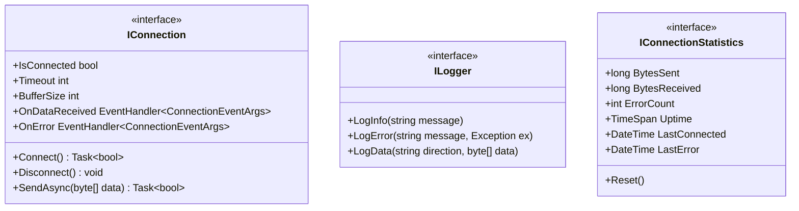
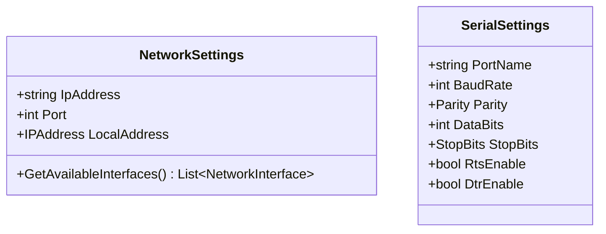
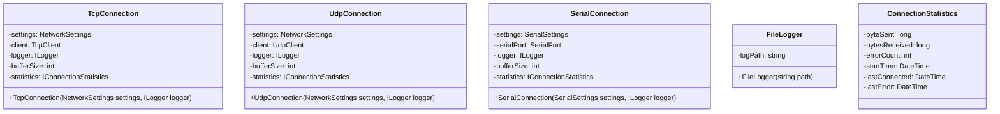

# 通信ライブラリ

TCP、UDP、シリアル通信を統一的なインターフェースで扱うためのライブラリです。

## 機能概要

- TCP/IP通信
- UDP通信
- シリアル通信
- 複数NICのサポート
- イベントベースの非同期通信
- 包括的なエラーハンドリング
- ログ機能
- 通信統計と診断機能

## クラス構造

### 基本インターフェース


### 設定クラス


### 実装クラス


## プロジェクト構造

```
WpfApp1/
└── Connections/
    ├── Interfaces/
    │   ├── IConnection.cs
    │   ├── ILogger.cs
    │   └── IConnectionStatistics.cs
    ├── Models/
    │   ├── ConnectionEventArgs.cs
    │   ├── NetworkSettings.cs
    │   └── SerialSettings.cs
    ├── Implementations/
    │   ├── TcpConnection.cs
    │   ├── UdpConnection.cs
    │   └── SerialConnection.cs
    ├── Logging/
    │   └── FileLogger.cs
    └── Statistics/
        └── ConnectionStatistics.cs
```

## 使用例

```csharp
// TCP接続の例
var interfaces = NetworkSettings.GetAvailableInterfaces();
var selectedInterface = interfaces[0];

var networkSettings = new NetworkSettings
{
    IpAddress = "192.168.1.100",
    Port = 8080,
    LocalAddress = selectedInterface.GetIPProperties()
        .UnicastAddresses
        .First(a => a.Address.AddressFamily == AddressFamily.InterNetwork)
        .Address
};

var logger = new FileLogger("logs/connection.log");
var tcpConnection = new TcpConnection(networkSettings, logger) 
{
    Timeout = 5000,    // 5秒
    BufferSize = 1024  // 1KB
};

// イベントハンドラの設定
tcpConnection.OnDataReceived += (sender, e) => {
    // データ受信時の処理
};

tcpConnection.OnError += (sender, e) => {
    // エラー発生時の処理
};

// 接続
await tcpConnection.Connect();

// データ送信
await tcpConnection.SendAsync(new byte[] { 0x01, 0x02, 0x03 });

// 統計情報の確認
var stats = tcpConnection.Statistics;
Console.WriteLine($"送信バイト数: {stats.BytesSent}");
Console.WriteLine($"受信バイト数: {stats.BytesReceived}");
Console.WriteLine($"エラー数: {stats.ErrorCount}");
```

## エラー処理

```csharp
public enum ConnectionErrorType
{
    Network,
    Timeout,
    Hardware,
    InvalidData
}

try
{
    await connection.Connect();
}
catch (ConnectionException ex) when (ex.ErrorType == ConnectionErrorType.Timeout)
{
    // タイムアウトエラーの処理
}
catch (ConnectionException ex)
{
    // その他のエラーの処理
    logger.LogError($"接続エラー: {ex.Message}", ex);
}
