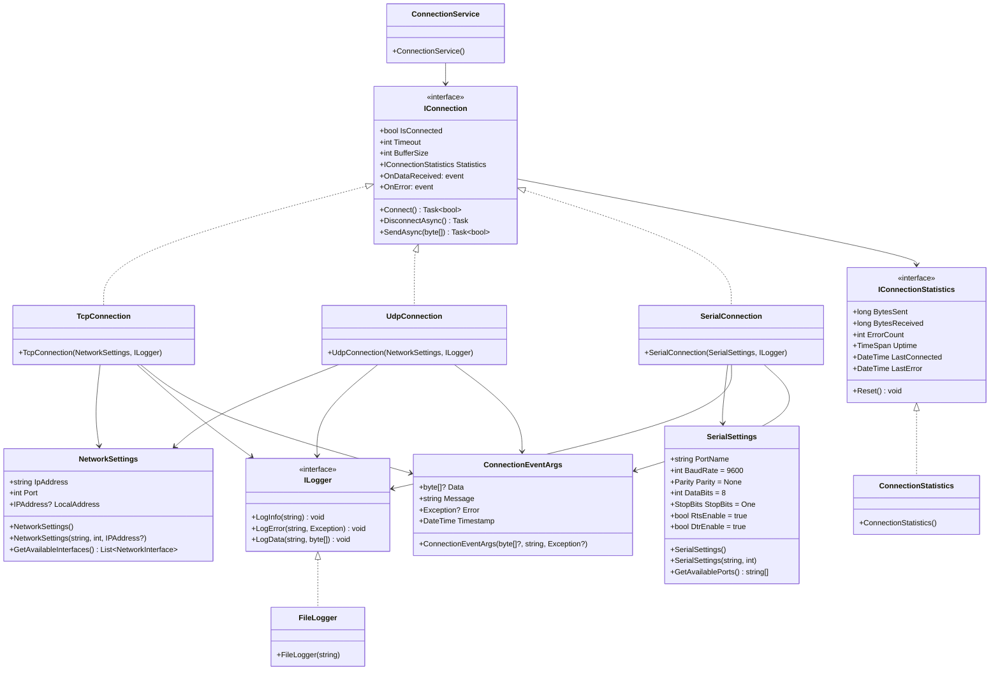

# 通信ライブラリとテストアプリケーション

TCP、UDP、シリアル通信を統一的なインターフェースで扱うライブラリとそのテストアプリケーションです。

## 機能

- TCP/IP通信
- UDP通信
- シリアル通信
- 複数NICのサポート
- イベントベースの非同期通信
- 包括的なエラーハンドリング
- ログ機能
- 通信統計と診断機能

## クラス図



## プロジェクト構成

```
WpfApp1/
├── WpfApp1/
│   ├── Controls/
│   │   ├── CommonWindow.xaml       # 共通ウィンドウ基底クラス
│   │   └── CustomWindow.xaml       # カスタムウィンドウ
│   ├── Services/
│   │   └── ConnectionService.cs    # 通信サービス
│   └── Connections/
│       ├── Interfaces/
│       │   ├── IConnection.cs      # 基本通信インターフェース
│       │   ├── ILogger.cs          # ログ機能インターフェース
│       │   └── IConnectionStatistics.cs # 統計情報インターフェース
│       ├── Models/
│       │   ├── ConnectionEventArgs.cs # イベント用データ構造
│       │   ├── NetworkSettings.cs    # TCP/UDP設定
│       │   └── SerialSettings.cs     # シリアル通信設定
│       ├── Implementations/
│       │   ├── TcpConnection.cs     # TCP実装
│       │   ├── UdpConnection.cs     # UDP実装
│       │   └── SerialConnection.cs  # シリアル通信実装
│       ├── Logging/
│       │   └── FileLogger.cs       # ファイルログ実装
│       └── Statistics/
│           └── ConnectionStatistics.cs # 統計情報実装
└── WpfApp1.Tests/                  # テストプロジェクト
    ├── ConnectionEventArgsTests.cs
    ├── ConnectionStatisticsTests.cs
    ├── FileLoggerTests.cs
    ├── TcpConnectionTests.cs
    └── UdpConnectionTests.cs
```

## 使用方法

### TCP通信の例

```csharp
// 設定
var settings = new NetworkSettings("192.168.1.100", 8080);
var logger = new FileLogger("connection.log");
var connection = new TcpConnection(settings, logger);

// イベントハンドラの設定
connection.OnDataReceived += (sender, e) => {
    Console.WriteLine($"データ受信: {BitConverter.ToString(e.Data)}");
    Console.WriteLine($"タイムスタンプ: {e.Timestamp}");
};

connection.OnError += (sender, e) => {
    Console.WriteLine($"エラー: {e.Message}");
    Console.WriteLine($"発生時刻: {e.Timestamp}");
};

// 接続と送信
await connection.Connect();
await connection.SendAsync(new byte[] { 0x01, 0x02, 0x03, 0x04 });
await connection.DisconnectAsync();
```

### UDP通信の例

```csharp
var settings = new NetworkSettings("192.168.1.100", 8080);
var connection = new UdpConnection(settings, new FileLogger("udp.log"));
// 以下、TCPと同様
```

### シリアル通信の例

```csharp
var settings = new SerialSettings("COM1", 9600)
{
    DataBits = 8,
    Parity = Parity.None,
    StopBits = StopBits.One,
    RtsEnable = true,
    DtrEnable = true
};
var connection = new SerialConnection(settings, new FileLogger("serial.log"));
// 以下、TCPと同様
```

## テストアプリケーション

- 共通ウィンドウ
  - 通信方式の選択（TCP/UDP/Serial）
  - 接続パラメータの設定
    - TCP/UDP: IPアドレス、ポート、使用NIC
    - シリアル: COMポート、ボーレート（9600-115200）
  - 接続/切断操作
  - ログ表示機能
    - リアルタイムログ表示
    - ログのクリア/保存機能

- カスタムウィンドウ
  - テストデータの作成と送信
  - 送信データのテキスト入力
  - 接続状態に連動した送信ボタンの有効/無効制御

## 実装の特徴

1. モジュール化された設計
   - インターフェースベースの実装
   - 共通基盤による異なる通信方式の統一的な扱い
   - 拡張性を考慮したサービス層の実装

2. 非同期処理
   - すべての通信処理が非同期
   - UI処理のブロッキングを防止
   - Task.Runを適切に使用
   - キャンセレーション対応

3. エラーハンドリング
   - 接続エラー処理
   - 送受信エラー処理
   - タイムアウト処理
   - イベントベースの通知
   - 適切な例外処理

4. ログと診断機能
   - 詳細なログ記録（送受信データ、エラー）
   - タイムスタンプ付きログ
   - ログの保存機能
   - リアルタイム統計情報
     - 送受信バイト数
     - エラー数
     - 接続時間
     - 最終エラー時刻

5. WPFベストプラクティス
   - MVVMパターンの部分的採用
   - カスタムコントロールの活用
   - 適切なデータバインディング
   - UIの非同期更新

## 必要要件

- .NET 8.0 Windows（WPF対応）
- System.IO.Ports パッケージ（シリアル通信用）
- Visual Studio 2022 または Visual Studio Code
